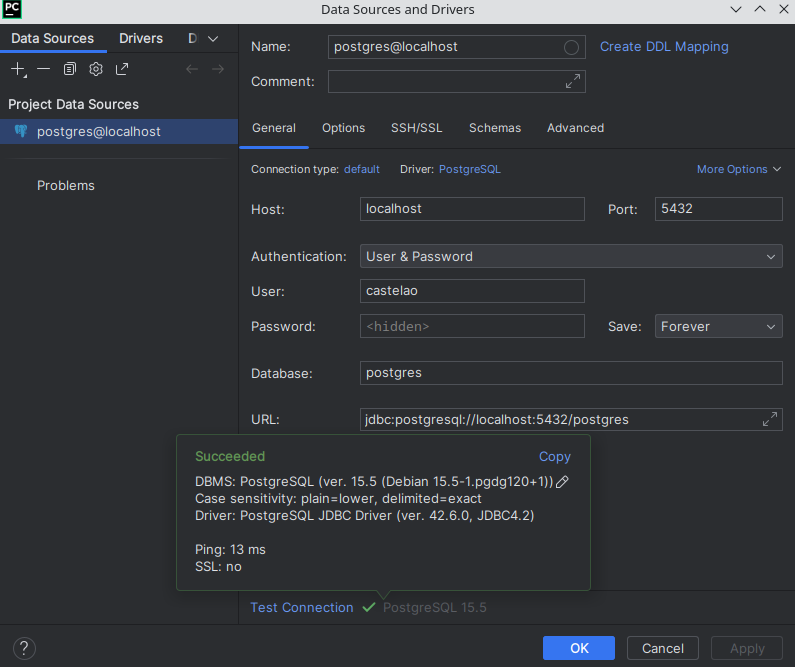
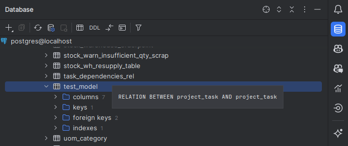
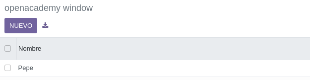
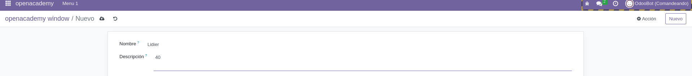
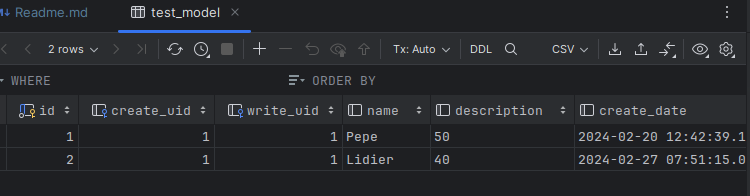

# Manejo de Odoo casi sin morir

## Preparacion de Odoo

Se debe desde la terminal de pycharm usar el comando `docker exec -u root -it odoocomandos-dam_odoo_dev-1 /bin/bash;`

Lo que permitira usa un terminal de ese odoo pero ademas con permisos de root.

Posterior se debe crear una carpeta dentro de la carpeta del proyecto llamada `extra-addons` y dentro de esta se debe de crear una carpeta con el nombre del modulo que se quiere crear.

En esa carpeta se traera todo el codigo del modulo que se quiere usar. Con el comando `mkdir extra-addons/` dentro la 
otra terminal sin odoo, para despues usar el comando `cd mnt/extra-addons/` para posicionarse en la carpeta, pero 
estando dentro de la terminal con odoo y luego usar `odoo scaffold openacademy/` lo que creara toda una esctructura de 
datos con lo necesario para ser usado en odoo.

Para terminar se debe de cambiar los permisos para que desde fuera de la terminal podamos hacer cambios comodamente,
el comando es `chmod -R 777 openacademy/`.

## Conexion con la base de datos

Se hace un docker compose up para levantar el odoo. Y hacer ahora la conexion con pycharm.



Con los datos que se le hayan dado en el docker compose

## Creación de un modelo

Se debe de cambiar el archivo de models de la carpeta `openacademy/models` para que tenga el siguiente contenido:

```python

class TestModel(models.Model):
    _name = "test_model"
    _description = "Test Model"

    name = fields.Char(string="Nombre")
    description = fields.Text(string="Descripción")
```
Para asi poder seguir con este ejemplo y los datos dados en el.

Ahora se deben de hacer unos cambios en el archivo `__manifest__.py` son:
- agregarle a data `data/datos.xml`
- descomentar la linea de `security/ir.model.access.csv`

Lo primero es para que utiliza como datos la estructura xml que le daremos.

Y lo segundo es para establecerle el modo que se debe de mostrar luego en odoo con sus datos para que asi pueda verlos
usando los datos al darle los permisos necesarios.

## Manejo de la tabla en la base de datos

Para darle los datos sobre los que queremos que trabaje.

Se debe de reinicar el conteneder que tenga el odoo y el que tenga la base de datos, para luego en la sección de la 
conexion de pycharm darle a la opcion de mostrar todas la tablas y luego ir a public/tables y buscar la tabla con el 
nombre del modelo que se la haya dado en el archivo del modelo propio.



## Agregar el XML

Tal y como se añadio en la parte del manifest de openacademy, se debe de añadir el archivo `datos.xml` en la carpeta de 
data. Con el siguiente contenido:

```python
<odoo>
    <data>
        <record model="test_model" id="openacademy.nombres">
            <field name="name">Pepe</field> <!-- El nombre debe ser el mismo que la variable del modelo -->
            <field name="description">50</field> <!-- El nombre debe ser el mismo que la variable del modelo -->
        </record>
    </data>
</odoo>
```

## Configuración de la vista

En `openacademy/views/views.xml` se descomentan las siguietes lineas:
- los action del modelo
- el top menu item
- el menu category
- el action con el action_windows

## Configuración de los datos
En `openacademy/security/ir.model.access.csv` se debe de cambiar la columna del id por `model_NombreDelModelo` en mi caso es `test_model`

recordar los otros del mafest de habilitar el security, cambiar el nombre del modelo con el que tiene el modelo 
(test_model en mi caso), y luego en los actions cambiar lo del openacademy.opencademy por el nombre del modelo

## Manejo en Odoo

Se empezaria por hacer un restart al contenedor con odoo.

Se comenzaria por ir a configuracion y activar el modo de desarrollador.

Para luego ir a la pagina de odoo y buscar el openacademy, activarlo y e ir a la seccion superior de seleccion de 
modulos y ver como tiene los datos previos dados.




Se puede comprobar como se añaden los datos a la tabla si lo hacemos desde Odoo.



Abajo se puede ver como se metieron los datos en la tabla, que se puede ver en Pycharm.



